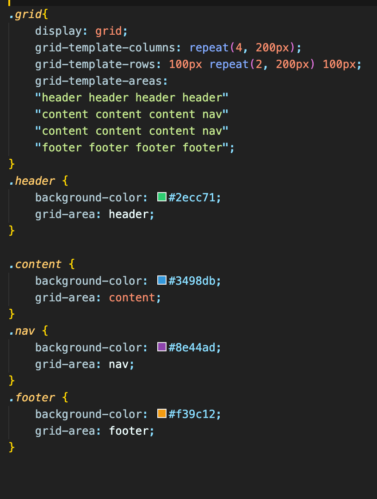
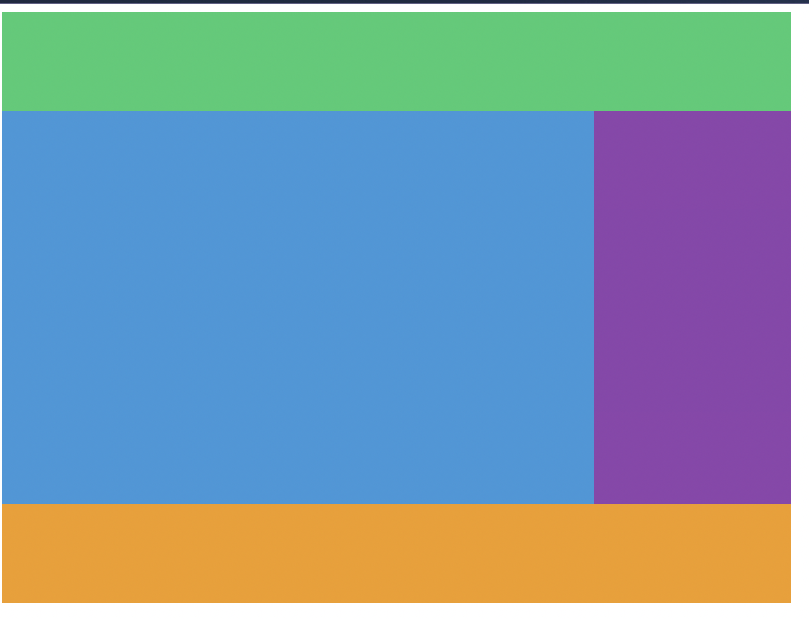
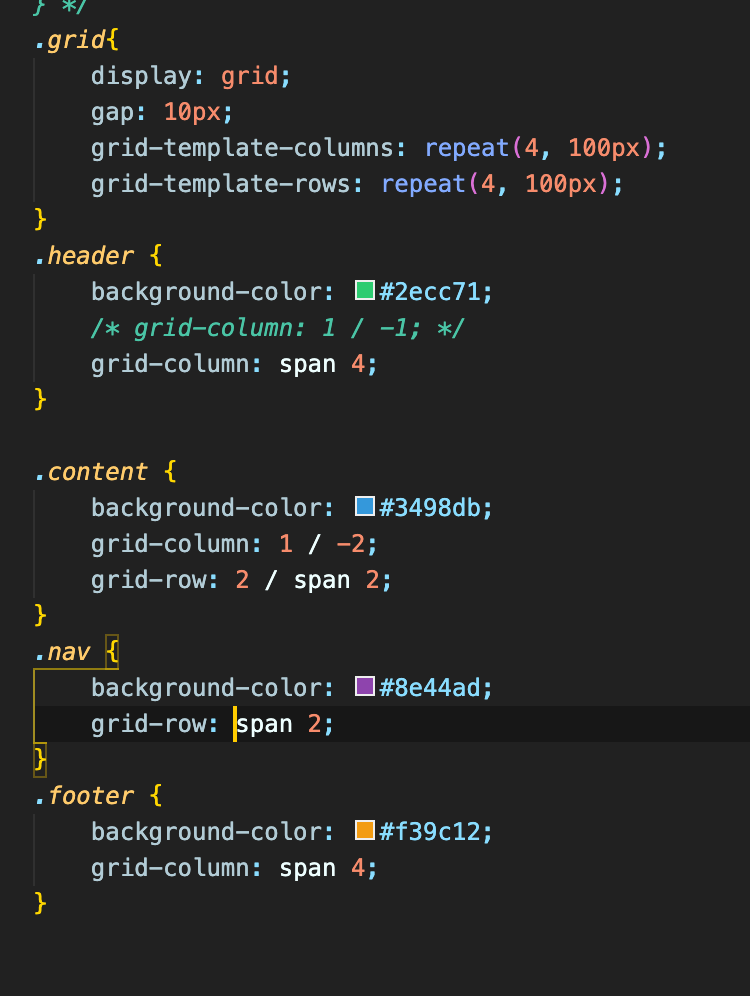
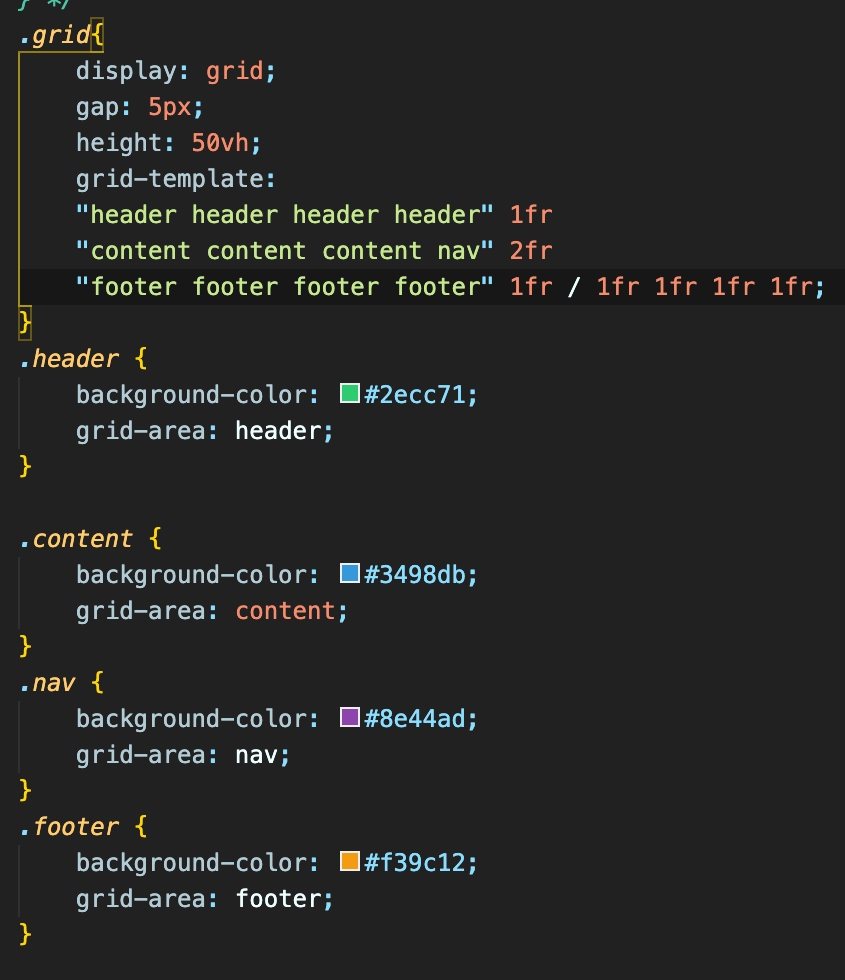
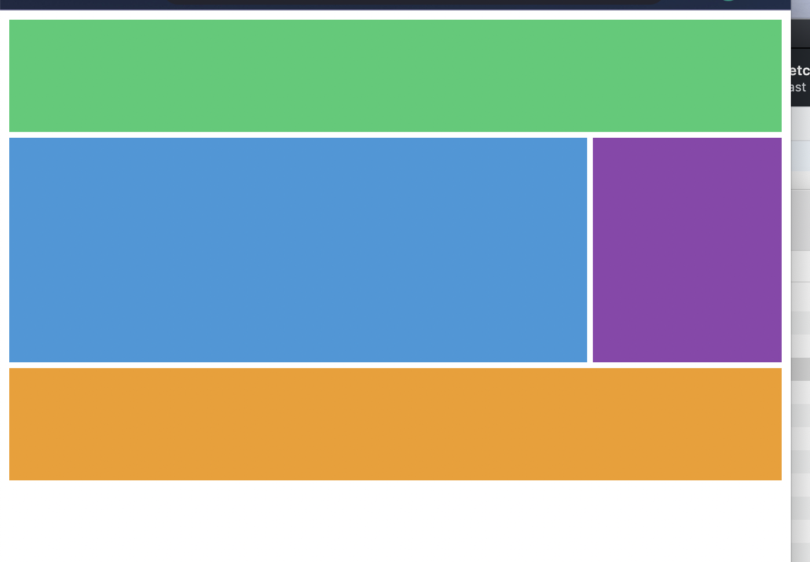
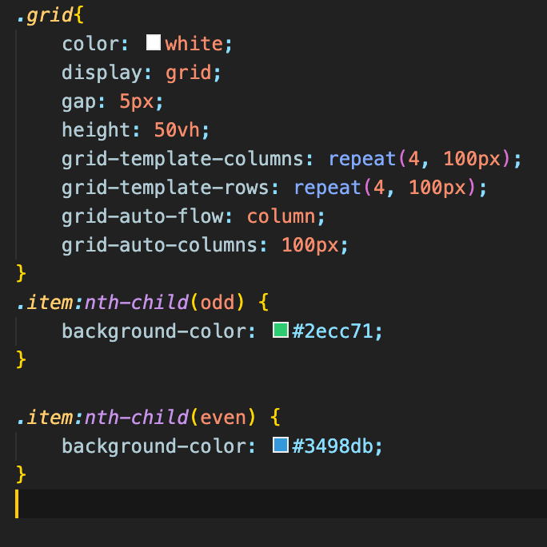
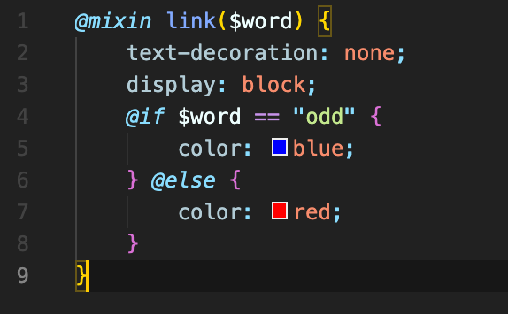
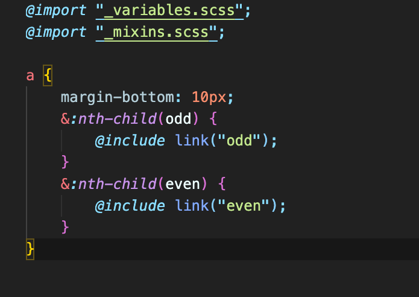

# csslayout

css 심화 강의 모음 & 사용법

## flexbox

* flex를 사용할 때 조건은 첫번쨰로 부모에게 입력해야 실행이 가능하다. 만약 자식에게 사용할 경우 사용할 수가 없다.
* flex에서 가로로 움직이는 방식과 세로로 움직이는 방식이 있다. display:flex를 하면 기본적으로 row형태(가로형태)로 변환.
* justify-content는 자식들을 가로로 붙어 있게 할수도 있고 같은 간격으로 띄워 줄 수 있고, 가운데로 모아 줄 수 있다.
* align-items는 방향은 그대로 가로로인데 수평으로 움직이게 해준다. height를 이용해서 움직일 수 있다.
* flex-direction: column을 이용하면 중식축이 변환. 이때, 가로로되어 있던 중식축이 세로로 변경이 된다.
* class명:nth-child(2) 는 동일한 class명중에 2번째 자식을 가리키는 말이다.
* class명:nth-child()를 통해 순서를 바꿀수도 있고, 따로 지정한 자식만 변경이 필요한 경우에 사용을 한다.
* flex-wrap을 이용하면 width간격이 일정해진다.
* flex-shrink는 화면이 줄어들 떄 지정한 것을 다른것과 다르게 더 줄여주는(?) 역할이다.
* flex-grow는 shrink와 반대로 지정한 것을 크게 만들어 준다.
* align-self는 class명:nth-child()에 한개만 조작 할 수 있게 해준다. (flex-end, center)
* order는 순서를 변경?? 해준다고 이해를 했는데 이 부분은 좀 더 공부할 필요가 있을것 같다.

## Grid

* grid-template-columns: 250px 250px 250px; 이것은 3개의 box를 가로로 250px 만큼 늘려준다.
* grid-template-rows: 100px 50px 300px; 같은 경우에는 세로로 각 box마다 늘려준다.
* gap 같은 경우에는 각 box마다 전체적인 간격을 나눠준다.
* column-gap 같은 경우 가로로 얼마만큰 간격을 주는지 나타낸다.
* row-gap 같은 경우에는 세로로 얼마만큼 간격을 주는지 나타낸다.
* grid-template-areas는 각각의 box마다 색을 주고 변형을 줄 수 있게 해준다. 

   위의 사진처럼 각각 class에다가 사용할 명칭을 정해주고, 그리고 부모 class에다가 각각 하나씩 어떤 식으로 사용할지 넣어준다.

   만약 위와 같이 했을 경우 이런식으로 나타나게 된다.

* grid-column-start: 1;, grid-column-end: 5; 을 사용을 할 줄 알면 위의 사진과 같이 똑같이 만들 수 있다.
* grid-column: 1 / 5 , grid-row: 1 / 4; 를 위에 방식을 줄여서 사용 할 수 있는데, / 앞은 start고 뒷 부분은
  end 부분이다. 그래서 코드를 좀 더 깔끔하고 코드양을 줄일 수 있다.
* span의 경우 공간(?)을 차지하는 뜻으로 이해를 했다. 이 부분은 계속 사용해보면서 이해도를 높이는 것 밖에 설명을 할 수가 없다.
(개인적으로....)

* grid template 를 이용해서 지금까지 만든 레이아웃을 만들수 있다 
* 그중에서 1fr이 있는데 fr은 화면 비율에 맞게 알아서 크기를 맞춰 주는 역할을 한다. 

  사진과 같이 코드를 짜면 밑의 사진에 나오는 것처럼 지금까지 만든 레이아웃을 짤 수 있다.

* fr의 장점은 아무리 창을 줄이고 늘려도 그에 알맞게 간격을 유지해준다는 장점이 있다.
* 만약 프로젝트 중에서 화면을 줄여도 같은 크기를 원하고 변하는 것을 원치 않을때 사용하면 많이 유용할 것 같다.
* grid-auto-row를 사용하여 사이즈를 맞추어 주는 것이다. 아무리 row 방향으로 div가 늘어나도 정해준 사이즈만 지정해주면 몇개가 늘어나도 사이즈를 같게 해준다.
* grid-auto-flow:column은 여러개의 div가 존재 했을 때, 수직으로 나타나게 해주는 것이 아니라 수평으로 변환하고 옆으로 늘려주는 css이다. 
* 수평으로 간격과 크기를 맞추기를 원한다면 grid-auto-row와 같은 grid-auto-column으로 맞춰 주면 된다.

  코드는 위의 사진을 보고 이해하면 좋다.
  
  
* minimax(100px, 1fr)은 grid-template-columns가 아무리 많아도 크기를 고정해주는 역활을 맡고있다.

## scss

* styles.scss에서 작업을 하면 ./dest/style.css에 반영이 되고, sass를 css로 변환을 해준다.

*  _(언더바)를 사용하여 폴더를 만들어 주고 $(달러)를 사용하여 $변수 : 적용할 css를 적어준 후,  
style.scss에서 $변수명을 이용하여 import해 올 수 있다.  
이때, 꼭!!!!!! style.scss파일안에 적용할 파일 import를 해주어야 한다.

* mixin을 이용하여 function 처럼 사용 할 수 있다.
* mixin을 사용할 경우 _바를 이용하여 파일을 만들고 변수를 선언해주고 _mixins.scc파일을 만들고, 
불러주는 식으로 이용을 한다.

mixin의 예를 들면, 밑의 사진과 같이 사용이 가능하다.

* _mixins.scss
 

* _style.scss
